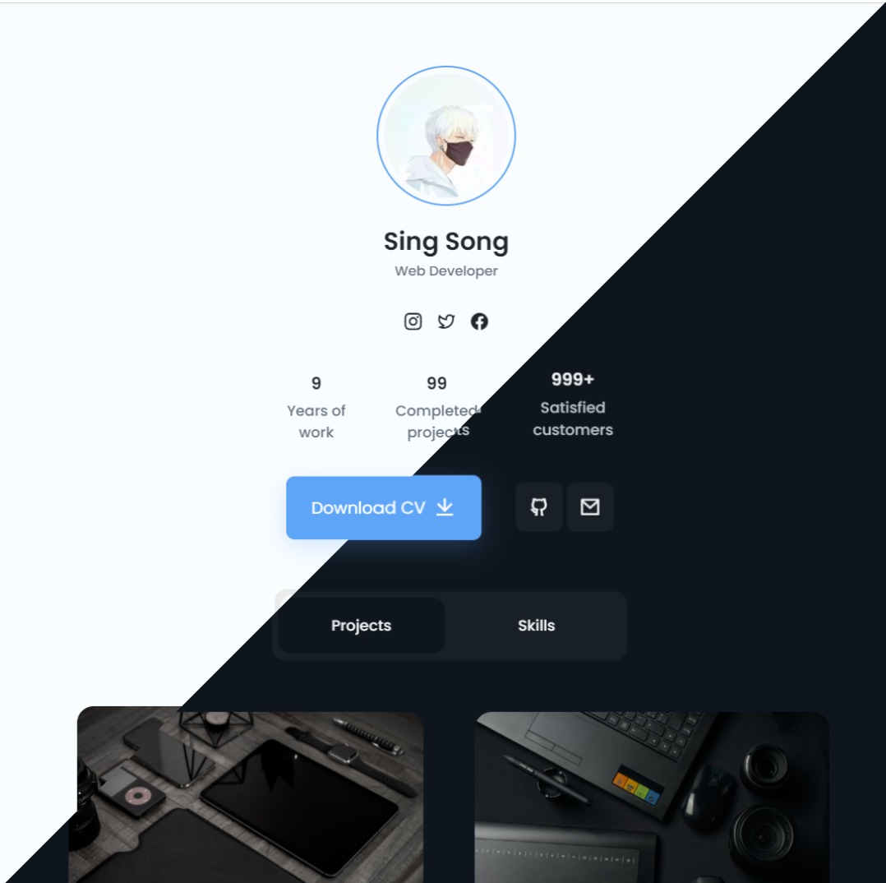

<div align="center">

<h1>Portoflio-Minimal</h1>

<h6>A Minimalistic Static Website Template with Light/Dark Theme</h6>

<a href="https://portfolio-minimal-sang-buster.vercel.app/" _target="blank">

</a>

---

<h3>🚀 Set-up</h3>

</div>

Clone this repository to a location of your choice

```bash
git clone https://github.com/Sang-Buster/Portfolio-Minimal.git && cd Portfolio-Minimal && cd src
```
Then use any tools you wish to open/edit `index.html` and enjoy!

